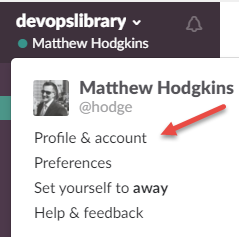
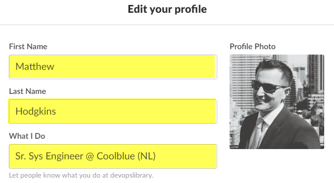

# DevOpsLibrary Slack Rules

DevOpsLibrary has a few simple rules to make sure that the chat stays beneficial for everyone, and not an annoyance.

<!-- TOC depthFrom:2 depthTo:6 withLinks:1 updateOnSave:1 orderedList:0 -->

- [Do you correctly fill out your profile?](#do-you-correctly-fill-out-your-profile)
- [Do you use snippets?](#do-you-use-snippets)
- [Do you edit previous messages if you make a mistake?](#do-you-edit-previous-messages-if-you-make-a-mistake)
- [Do you Google first before asking someone?](#do-you-google-first-before-asking-someone)
- [Do you keep your chat on the same line where appropriate?](#do-you-keep-your-chat-on-the-same-line-where-appropriate)

<!-- /TOC -->

## Do you correctly fill out your profile?

DevOpsLibrary is a really great place to network and chat with a bunch of smart people, sort of like a networking session at a conference, but from your keyboard.

When at a conference you wear a name tag, but in Slack your profile is your name tag, so wear it proudly.

Click DevOpsLibrary up the top and click `Profile & Account`:

When your profile pops up, please fill out **First Name**, **Last Name** and, **What I Do**.

When filling out what  you do, use the format of `Role @ Company (XX)`, where **XX** is the your 2 letter country code where you live ([you can find a list here](https://en.wikipedia.org/wiki/ISO_3166-1_alpha-2#Officially_assigned_code_elements)).

It's also nice to put up a profile picture so we can put a face to the name!

## Do you use snippets?

When pasting large blocks of code, use snippets instead of pasting a wall of text.

## Do you edit previous messages if you make a mistake?

If you make a mistake when typing a message, simply press the `up arrow` in Slack to fix your mistake.

> :x: Bad Example - Don't fix things on a new line
>

&nbsp;

> :white_check_mark: Good Example - Editing previous message
>

## Do you Google first before asking someone?

Asking someone for help should not be your first course of action. Search for solutions yourself first before asking some. If you don't, expect to be [lmgtfy'ed](http://bfy.tw/QI).

## Do you keep your chat on the same line where appropriate?

Slack chat is not the same as having an SMS conversation with 13 year olds - Keep things together where possible and don't split sentences across lines.

> :x: Bad Example - Don't span things across multiple lines
>

&nbsp;

> :white_check_mark: Good Example - Saying something in the same line
>

